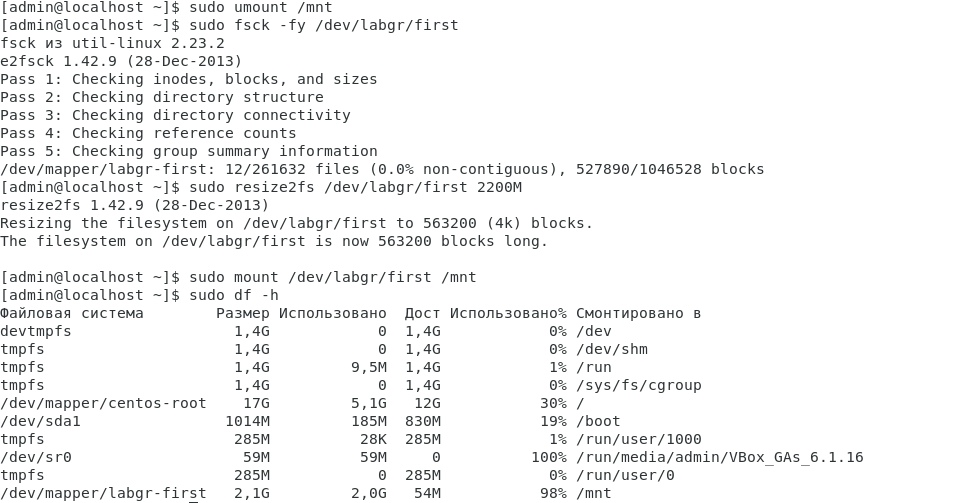

# linux-lab5

## 1. Создать файловую систему на логическом томе и смонтировать её

Систему дисков будем использовать из предыдущего задания. Установим необходимый пакет командой ```sudo yum install -y lvm2```. Проверим базовую конфигурацию командами ```lsblk``` и ```lvmdiskscan```:


Добавим диск b как физический том командой ```sudo pvcreate /dev/sdb```. Проверим создание командами ```sudo pvdisplay``` и ```sudo pvs```:


Далее создадим виртуальную группу командой ```sudo vgcreate labgr /dev/sdb``` и проверим корректность создания командами ```sudo vgdisplay -v labgr``` и ```sudo vgs```:


Повторим похожие действия для создания логической группы ```sudo lvcreate -l+100%FREE -n first labgr``` и проверяем ```sudo lvdisplay``` ```sudo lvs```:


Создадим файловую систему ```sudo mkfs.ext4 /dev/mai/first``` и смонтируем её ```sudo mount /dev/labgr/first /mnt``` ```sudo mount```:


## 2. Создать файл, заполенный нулями на весь размер точки монтирования.

Для этого просто выполним команду ```sudo dd if=/dev/zero of=/mnt/mock.file bs=1M count=4500 status=progress``` чтобы побайтово скопировать в файл 4500 чанков по 1М, после чего проверим состояние командой ```df -h```:


## 3. Расширить vg, lv и файловую систему.

Введём команды:
```
sudo pvcreate /dev/sdc
sudo vgextend labgr /dev/sdc
sudo lvextend -l+100%FREE /dev/labgr/first
sudo lvdisplay
sudo lvs
sudo df -h
```
Результат:


Теперь произведём расширение файловой системы:

```
sudo resize2fs /dev/labgr/first
sudo df -h
```


## 4. Уменьшить файловую систему.

Для уменьшения ФС отмонтируем её, после чего пересоберём том и систему. При уменьшении размеров системы необходимо учитывать минимальное пространство, которое ей необходимо, чтобы не обрезать нужные файлы, поэтому был оставлен небольшой запас:

```
sudo umount /mnt
sudo fsck -fy /dev/labgr/first
sudo resize2fs /dev/labgr/first 2100M             
//sudo resize2fs -M /dev/labgr/first чтобы ужать систему до возножного минимума
sudo mount /dev/labgr/first /mnt
sudo df -h
```



