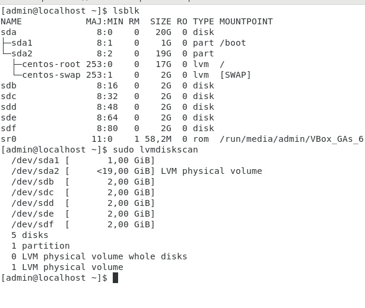

# linux-lab5

## 1. Создать файловую систему на логическом томе и смонтировать её

Систему дисков будем использовать из предыдущего задания. Установим необходимый пакет командой ```sudo yum install -y lvm2```. Проверим базовую конфигурацию командами ```lsblk``` и ```lvmdiskscan```:



Добавим диск b как физический том командой ```sudo pvcreate /dev/sdb```. Проверим создание командами ```sudo pvdisplay``` и ```sudo pvs```:


Далее создадим виртуальную группу командой ```sudo vgcreate labgr /dev/sdb``` и проверим корректность создания командами ```sudo vgdisplay -v labgr``` и ```sudo vgs```:


Повторим похожие действия для создания логической группы ```sudo lvcreate -l+100%FREE -n first labgr``` и проверяем ```sudo lvdisplay``` ```sudo lvs```:


Создадим файловую систему ```sudo mkfs.ext4 /dev/mai/first``` и смонтируем её ```sudo mount /dev/labgr/first /mnt``` ```sudo mount```:


## 2. Создать файл, заполенный нулями на весь размер точки монтирования.

Для этого просто выполним команду ```sudo dd if=/dev/zero of=/mnt/mock.file bs=1M count=4500 status=progress``` чтобы побайтово скопировать в файл 4500 чанков по 1М, после чего проверим состояние командой ```df -h```:


## 3. Расширить vg, lv и файловую систему.

Введём команды:
```
sudo pvcreate /dev/sdc
sudo vgextend labgr /dev/sdc
sudo lvextend -l+100%FREE /dev/labgr/first
sudo lvdisplay
sudo lvs
sudo df -h
```
Результат:


Теперь произведём расширение файловой системы:

```
sudo resize2fs /dev/labgr/first
sudo df -h
```


## 4. Уменьшить файловую систему.

Для уменьшения ФС отмонтируем её, после чего пересоберём том и систему. При уменьшении размеров системы необходимо учитывать минимальное пространство, которое ей необходимо, чтобы не обрезать нужные файлы, поэтому был оставлен небольшой запас:

```bash
sudo umount /mnt
sudo fsck -fy /dev/labgr/first
sudo resize2fs /dev/labgr/first 2100M
sudo lvreduce -L 2100M /dev/labgr/first
sudo mount /dev/labgr/first /mnt

# Проверяем память
sudo lvs
sudo df -h
```


## 5. Создать несколько новых файлов и создать снимок.

Создадим несколько файлов и сделаем снимок. Для этого выполним следующую последовательность команд:

```
sudo touch /mnt/fillerfile{1..5}
ls /mnt
sudo lvcreate -L 100M -s -n log_snapsh /dev/mai/first
sudo lvs
sudo lsblk
```

Результат - в нашей vg создан снапшот, по которому можно будет откатить систему к состоянию на момент его создания:


## 6. Удалить файлы и после монтирования снимка убедиться, что созданные нами файлы присутствуют.

Удалим файлы командой ```sudo rm -f /mnt/fillerfile{1..3}```, после чего проверим есть ли удалённые файлы на снапшоте

```
sudo mkdir /snapsh
sudo mount /dev/mai/log_snapsh /snapsh
ls /snapsh
sudo umount /snapsh
```

Видим результат:


## 7. Сделать слияние томов.

Чтобы выполнить слияние томов необходимо сначала отмонтировать систему, после ввести команды

```
sudo umount /mnt
sudo lvconvert --merge /dev/labgr/log_snapsh
sudo mount /dev/labgr/first /mnt
ls /mnt
```


## 8. Сделать зеркало.

Для этого понадобится добавить еще устройств в PV, их я заготовил заранее аналогичным образом. После создадим ```VG sudo vgcreate labgrMirror /dev/sd{d,e}``` и смонтируем LV с флагом того, что она монтируется с созданием зеркала ```sudo lvcreate -l+100%FREE -m1 -n fMirror labgrMirror```:


Как видно из скрина, зеркало создано и синхронизировано:


